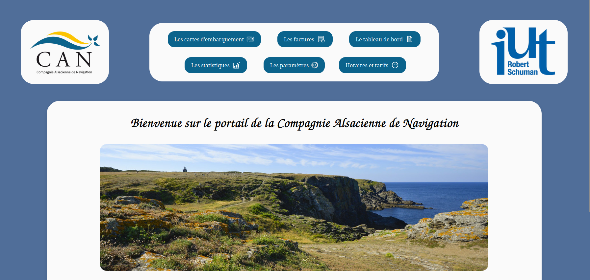
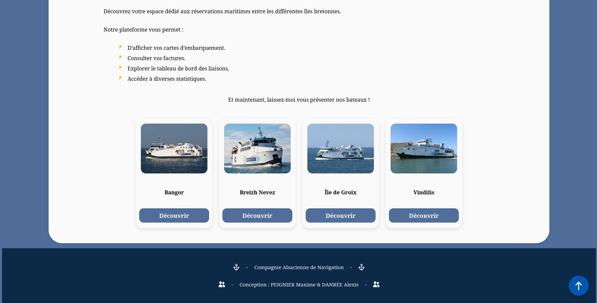
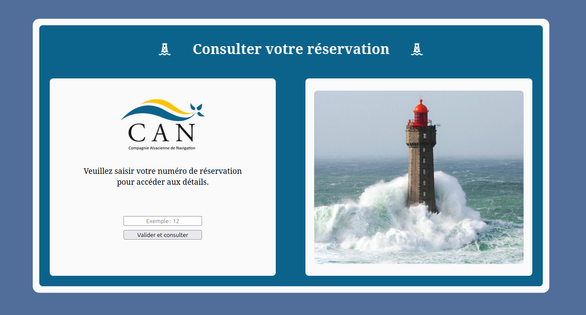
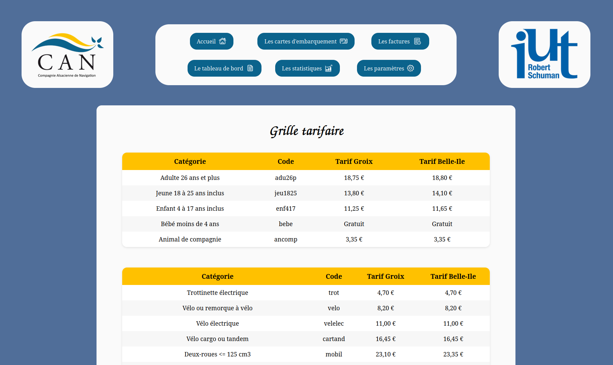
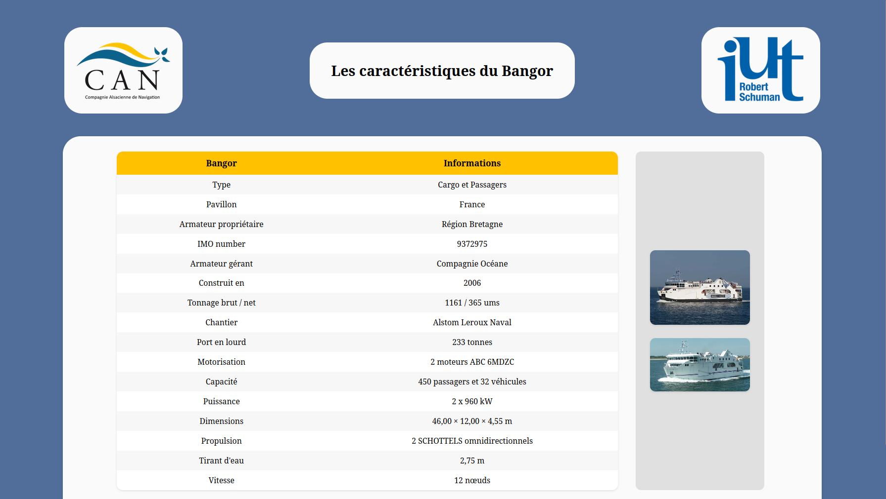
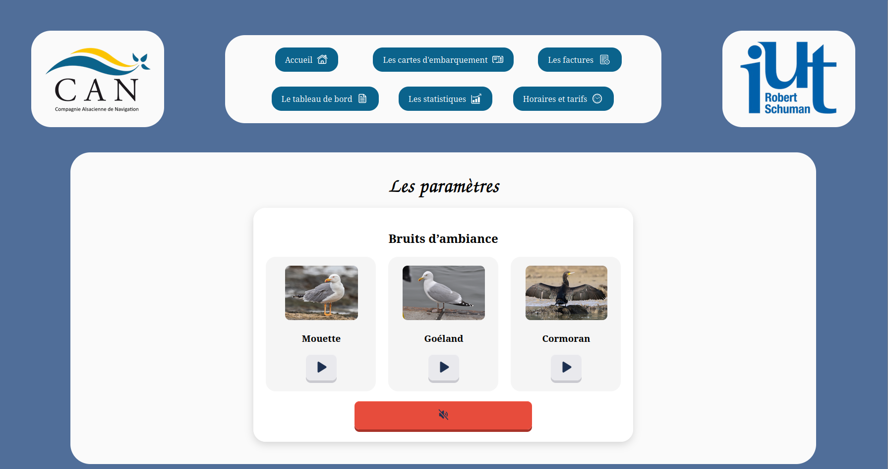

<!-- |-------------------------------------------------------------------------------------------| -->
<!-- |                                         LANGUAGE                                          | -->
<!-- |-------------------------------------------------------------------------------------------| -->
<div align="right">
  <a href="README.md">
    
  </a>
  <a href="README.en.md">
    
  </a>
</div>

<!-- |-------------------------------------------------------------------------------------------| -->
<!-- |                                          HEADER                                           | -->
<!-- |-------------------------------------------------------------------------------------------| -->
<h1 align="left">🚢 Maritime Booking System</h1>

<p align="justify">
This project is a booking system for a fictional maritime company, developed in pairs as part of a school project. It consists of a C# console application allowing a user to make a booking, and a website allowing the information related to that booking to be consulted.
</p>

<p align="justify">
The school API used by the website is now closed. The code remains available to showcase the work done, but the website can no longer fetch live data for certain pages.
</p>

<!-- |-------------------------------------------------------------------------------------------| -->
<!-- |                                       ABOUT                                               | -->
<!-- |-------------------------------------------------------------------------------------------| -->
## 🎯 About the project

<p align="justify">
The C# application allows a user to book a crossing for people and vehicles. Once the booking is complete, a JSON file is generated summarizing all the information entered.
</p>

<p align="justify">
The website then allows the information related to this booking to be consulted: boarding pass with QR code, invoice, dashboard, and statistics. It also offers pages independent of the booking data: boat presentation, schedules and fares, and a settings page.
</p>

<p align="justify">
The C# application uses the Newtonsoft.Json library to generate the JSON file. The website uses QRCode.js to generate the QR codes on the boarding passes, and html2canvas to download the invoices. The site's layout is built with Flexbox and is responsive, including on mobile.
</p>

<!-- |-------------------------------------------------------------------------------------------| -->
<!-- |                                        PREVIEW                                            | -->
<!-- |-------------------------------------------------------------------------------------------| -->
## 📸 Preview

**Image of the home menu:**
<div align="center">
  
</div>
<div align="center">
  
</div>
<br>

**Image of the booking lookup page:**
<div align="center">
  
</div>
<br>

**Image of the schedules and fares page:**
<div align="center">
  
</div>
<br>

**Image of the boat presentation page:**
<div align="center">
  
</div>
<br>

**Image of the settings page:**
<div align="center">
  
</div>
<br>

<p align="justify">
The boarding pass, invoice, dashboard, and statistics pages were indeed developed, but can no longer be demonstrated under real conditions since the school API was closed.
</p>
<br>

<!-- |-------------------------------------------------------------------------------------------| -->
<!-- |                                        USAGE                                              | -->
<!-- |-------------------------------------------------------------------------------------------| -->
## 🚀 Running the project

<p align="justify">
<b>C# application:</b> To run the C# application, open the Prog folder in Visual Studio, then run it by pressing F5 or clicking the green arrow. You can also build the project and run the generated .exe file directly.
</p>

<p align="justify">
<b>Website:</b> To run the website, open the Web folder in Visual Studio Code, then launch the site with the Live Server extension by clicking the Go Live button at the bottom right of the editor.
</p>
<br>

<!-- |-------------------------------------------------------------------------------------------| -->
<!-- |                                    PROJECT STRUCTURE                                      | -->
<!-- |-------------------------------------------------------------------------------------------| -->
## 📁 Project structure

```text
Maritime-booking-system/
├── Prog/                     # C# console application
├── Web/                      # After-sales website (HTML, CSS, JS)
├── Images/                   # Images used in the README
├── Rapport SAÉ 11.pdf        # Project report
├── LICENSE
└── README.md
└── README.en.md
```
<br>

<!-- |-------------------------------------------------------------------------------------------| -->
<!-- |                                       LIMITATIONS                                         | -->
<!-- |-------------------------------------------------------------------------------------------| -->
## 🔧 Known limitations

<p align="justify">
Once a booking number has been entered on the website, it is currently not possible to log out to look up another one without manually reloading the page. This is an improvement point identified for a future version. The website's design, which I was responsible for at the time, was suited to the project's requirements, but I find it a bit outdated looking back.
</p>
<br>

<!-- |-------------------------------------------------------------------------------------------| -->
<!-- |                                      CONTRIBUTORS                                         | -->
<!-- |-------------------------------------------------------------------------------------------| -->
## 👥 Contributors

Work carried out in pairs as part of a project at IUT Robert Schuman.

<div align="center">

[](https://github.com/rmax3iu)
[](https://github.com/AgentOutsiders)

</div>
